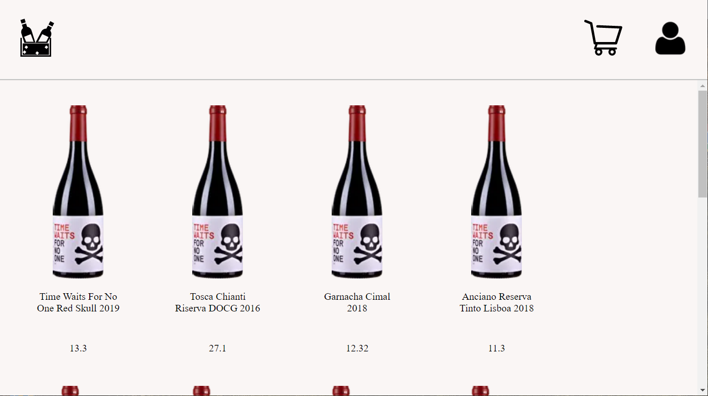
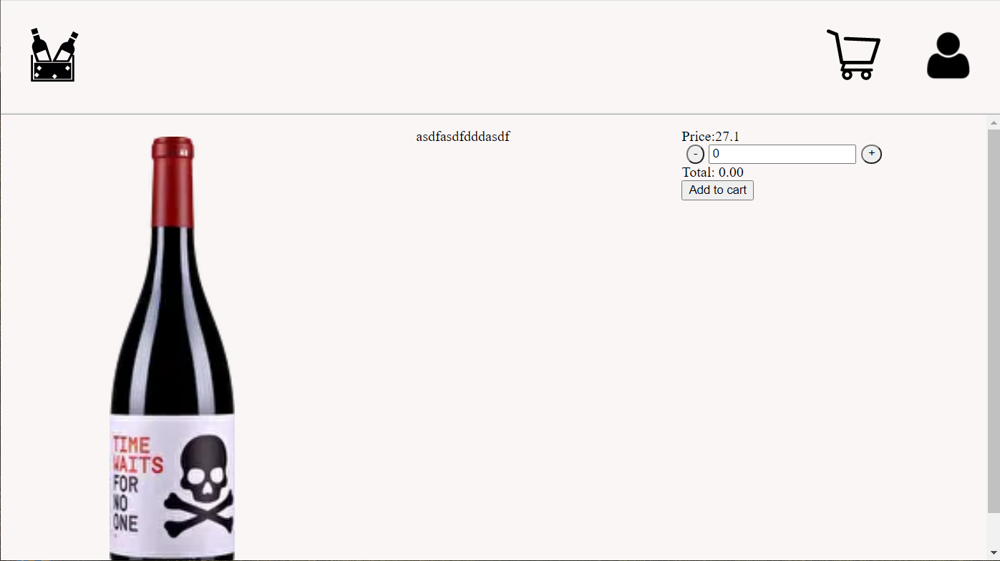
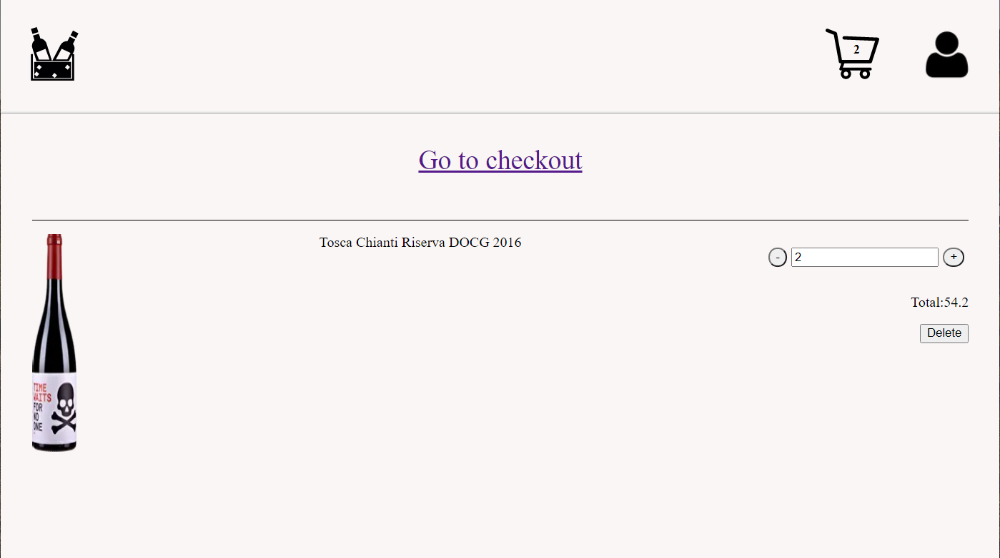
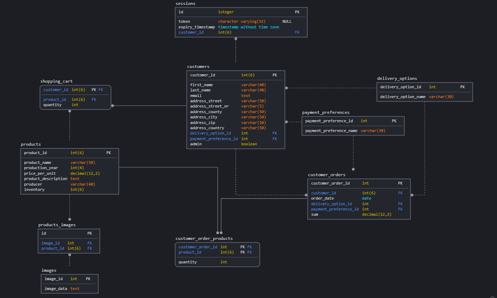

Create a readme with:

- title
- description
- all technologies used
- 1 or 2 screenshots
- setup instructions
- deployment instructions

<br/>

# Next.js E-Commmerce vine store

d
This is a [Next.js](https://nextjs.org/) vine e-commerce store project.

<br/>

## Features

<br>

- Show all products in shop



- Single product page
  - Show details of single product
  - Increase/Decrease quantity of single product and add it to the cart



- Shopping cart
  - Increase/Decrease quantity for products in the shopping cart
  - Click on product to go back to the products page
  - Delete product from cart



- Checkout
  - Enter delivery and billing address
  - Decide if billing address is different from billing address
  - Chose delivery option (premium/standard)
  - Buy now button leads to thank you page
- User accounts
  - Login as admin or standard user
  - Admin can change products description and price and can delete products from cart
  - Standard users can buy products. Order is stored in the database

<br/>

IMPORTANT: Cookies need to be activated

<br/>

## Technologies use

<br>

- Next.js
- Ley (for database migration)
- Cypress and Jest for testing
- Cookie management (cookies-js)
- Password management (argon2, crypto, CSFR)

<br>

## Getting Started

<br/>

First, make sure you have a postgres database up and running. Define your enviroment variables in an .env file<br/><br/>

```bash
PGHOST=########
PGDATABASE=###########
PGUSERNAME=###########
PGPASSWORD=###########
CSRF_TOKEN_SECRET=###########
```

and run the migration via

```bash
yarn migrate up
```

Run npm or yarn:

```bash
npm
# or
yarn
```

Run the development server:

```bash
npm run dev
# or
yarn dev
```

Open [http://localhost:3000](http://localhost:3000) with your browser to see the result.
<br/><br/>

## Data base structure

<br/><br/>


<br/>

## Deployment on Heroku

<br/>

- Add environment variable to for CSRF on Heroku
- Clone repository
- Create a new project on Heroku and configure automatic deploy on push
- Connect it to your repository
